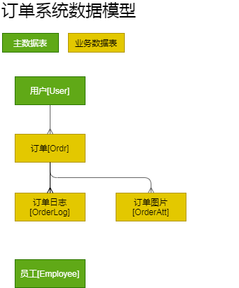

# 筋斗云产品设计

本文档分 **主体设计** 与 **专题设计** 两大部分.
每块设计一般包括以下部分:

概要设计
: 简述需求, 定义概念/术语, 简述实现方式.

数据库设计
: 定义数据库表及字段

交互接口
: 定义前端访问后端的API接口

前端应用接口
: 定义前端应用接口或应用内的页面.


参考文档：

- [后端框架：关于数据库设计、通讯协议设计、测试设计的惯例](doc/后端框架.html)
- [技术文档目录](doc/index.html)

## 概要设计

### 主要用例

定义用户使用本系统的主要场景。用于指导[系统建模]和[交互接口设计]。

系统主要用例见下图：


### 系统建模

定义系统数据模型，描述基本概念。用于指导[数据库设计]。

系统核心概念及关系见下图：



## 数据库设计

根据[系统建模]设计数据库表结构。

参考[后端框架-数据库设计](doc/后端框架.html#数据库设计)查看定义表及字段类型的基本规则.

**[系统配置项]**

@Cinf: id, name(s), value(t)

- name: 配置项名。由应用定义。下面文档中将使用`Cinf.xxx`来定义各配置项，比如`Cinf.version`表示name为"version"的配置项。

**[员工]**

@Employee: id, uname, phone(s), pwd, name(s), perms

雇员表, 登录后可用于查看和处理业务数据。

- uname: 用于登录的用户名，不可数字开头。
- phone: 员工手机号，也可用于登录，数字开头。
- pwd: 登录密码，采用md5加密。
- perms: EnumList. 角色列表，多个角色以逗号分隔，如"mgr", "emp,mgr"。

		emp: 管理员/AUTH_EMP
		mgr: 最高管理员/PERM_MGR

**[用户]**

@User: id, uname, phone(s), pwd, name(s), createTm

- uname: 用于登录的用户名，不可数字开头。
- phone: 员工手机号，也可用于登录，数字开头。
- pwd: 登录密码，采用md5加密。
- createTm: 创建时间。

**[订单]**

@Ordr: id, userId, createTm, status(2), amount, dscr(l), cmt(l)

vcol
: userName, userPhone, @orderLog?/订单日志OrderLog, @atts?/订单图片OrderAtt

- status: Enum. 订单状态。

		CR: 新创建
		RE: 已服务
		CA: 已取消

		其它备用值: 
		PA: 已付款(待服务)
		ST: 开始服务
		CL: 已结算

- @orderLog: [{id, action, dscr, ...}]. 日志子表, 关联表OrderLog
- @atts: [{id, attId}]. 订单图片，关联表OrderAtt

注意：使用ordr而不是order是为了避免与sql关键字order冲突

**[订单日志]**

@OrderLog: id, orderId, action, tm, dscr, empId

例如：某时创建订单，某时付款等。

- action: 参考订单状态(Ordr.status)。可用值参考：

		CR: Create (订单创建，待付款)
		PA: Pay (付款，待服务)
		RE: Receive (服务完成, 待评价)
		CA: Cancel (取消订单)
		RA: Rate (评价)
		ST: StartOrder (开始服务)
		CT: ChangeOrderTime (修改预约时间)
		AS: Assign (分派订单给员工)
		AC: Accept (员工接单)
		CL: Close (订单结算)

- empId: 操作该订单的员工号

**[订单-图片关联]**

@OrderAtt: id, orderId, attId

**[API调用日志]**

@ApiLog: id, tm, addr, ua(l), app, ses, userId, ac, t&, retval&, req(t), res(t), reqsz&, ressz&, ver, serverRev(10)

- app: Enum。存储请求的`_app`参数，常见值：

		emp-adm: 电脑管理端(web/index.html)
		user: 移动客户端(m2/index.html)

- ua: userAgent，用于区分客户端类型和版本
- ses: 会话标识(HTTP session id)
- t: 执行时间(单位：ms)
- ver: 客户端版本。

		web: 表示通用网页(通过ua可查看明细浏览器)
		wx/{ver}: 表示微信版本如"wx/6.2.5"
		a/{ver}: 表示安卓客户端及版本如"a/1"
		ios/{ver}: 表示苹果客户端版本如"ios/15".

@ApiLog1: id, apiLogId, ac, t&, retval&, req(t), res(t)

batch操作的明细表。

**[操作日志]**

@ObjLog: id, obj, objId, dscr, apiLogId, apiLog1Id

**[插件相关]**

```
@include server\plugin\login\DESIGN.md
@include server\plugin\upload\DESIGN.md
```

## 交互接口设计

本章根据[主要用例]定义应用客户端与服务端的交互接口。关于通讯协议基本规则，可参考[后端框架-通讯协议设计](doc/后端框架.html#通讯协议设计)。

### 客户端

app类型为"user".

#### 用户信息修改

	User.set()(name, ...)

- 权限: AUTH_USER
- 可修改字段参考User表。注意不可修改字段: uname, phone, pwd, createTm.

**[示例]**

上传一个头像并设置到该用户：

	upload(type=user, genThumb=1)(content of picture)
	(得到thumbId)
	
	User.set()(pidId={thumbId})

#### 订单管理

	添加订单
	Ordr.add()(Ordr表字段) -> id

	查看订单
	Ordr.query/get() -> tbl(id, status, ..., @orderLog?)

- 权限: AUTH_USER
- 添加订单后, 订单状态为"CR"; 且在OrderLog中添加一条创建记录(action=CR)
- 不允许删除订单（可以取消）。

### 员工端/后台管理端

本节API需要员工登录权限。
app类型为"emp".

#### 员工管理

	Employee.query()
	Employee.get(id?)
	Employee.set(id?)(POST fields)

- 权限: AUTH_EMP
- get/set操作如果不指定id, 则操作当前登录的员工。仅当具有 PERM_MGR 权限时, 可任意指定id.
- query操作：如果没有PERM_MGR权限只能获取当前登录的员工，否则可获取所有的员工。

以下仅当PERM_MGR权限可用：

	Employee.add()(POST fields)
	Employee.del(id?)

- 当Employee被其它对象（如Ordr）引用时，不允许删除，只能做禁用等其它处理。

#### 订单管理

查看订单

	Ordr.query
	Ordr.get

完成订单或取消订单

	Ordr.set(id)(status=RE)
	Ordr.set(id)(status=CA)

- 权限：AUTH_EMP
- 订单状态必须为"CR"才能完成或取消.
- 更新操作应生成相应订单日志(OrderLog).

## 前端应用接口

定义应用入口及调用参数。每一个应用均应明确定义一个惟一的app代码。

### 移动客户端(app=user)

	m2/index.html

用户登录, 可以创建和查看订单等.

### 管理端(app=emp-adm)

	web/store.html

员工登录, 可以查看和管理订单等.

### 超级管理端(app=admin)

	web/adm.html

使用超级管理员帐号登录.

## 后端内部接口

会话变量：

- 用户登录
	- uid: 用户编号
- 员工登录
	- empId: 员工编号

# 专题设计

## 用户登录

参考插件login
@include server\plugin\login\DESIGN.md

## 附件与上传

参考插件upload
@include server\plugin\upload\DESIGN.md

## 运营统计

