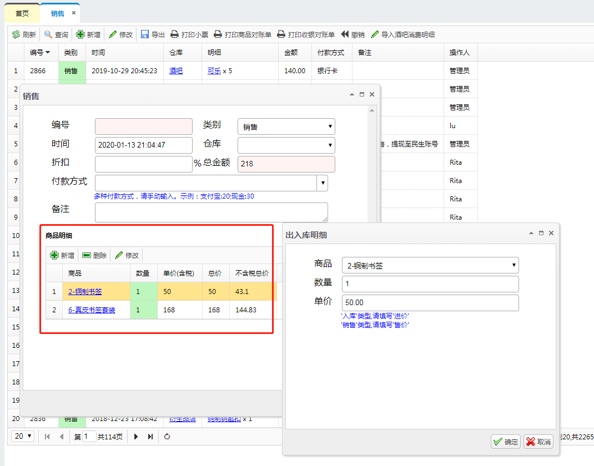
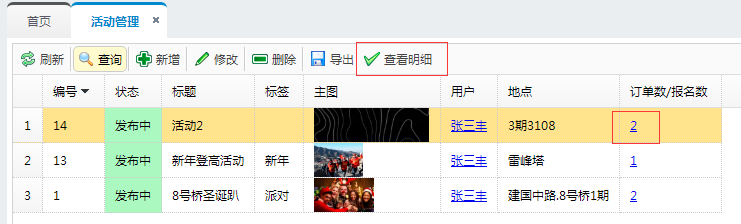
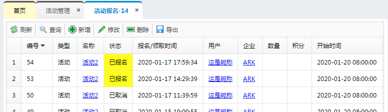

# 筋斗云开发实例讲解

准备好数据模型描述（参考tool\create-wui-page\meta-example.txt）
用在线工具生成对象管理源文件框架： http://localhost/dev/jdcloud/tool/
它可以生成管理端文件、升级数据库、服务端代码、更新菜单项。

也可以直接用命令行工具：server/web/page/create-wui-page.php
先准备好meta.txt文件放在该目录下，然后运行命令：

	create-wui-page.php -

写meta.txt示例：

	@User: id, name(s), storeId, status(4), weixinData(1000), dscr(t), picId, 积分&, adminFlag
	用户: 编号, 昵称, 企业/linkTo:Store/textField:storeName, 状态/enum:UserStatusList, 微信数据, 描述, 头像, 积分, 企业管理员/enum:YesNoMap

- storeId: 链接字段. linkTo/textField.
- status/adminFlag: 枚举字段. enum. 其中常量YesNoMap是框架预定义的，而UserStatusList需要在前端自行定义。
- 积分: 可以直接用中文字段，常用后缀还有：`&` 整数， `@` 货币（高精度小数）

注意：符号最好全用半角英文符号，但也兼容中文逗号和冒号。

## 下拉框：枚举类型字段

如type，status这种字段，由若干固定值构成。展示的需求为：

- 在对话框中，需要以下拉框的方式选择填写(my-combobox)
- 如果要做映射转化，如status的"CR"值需要显示成"未付款"，则在列表显示以及导出文件时，应显示正确文字。

### 使用Map定义枚举

在pageXXX.html中定义:

	<th data-options="field:'status', jdEnumMap: OrderStatusMap, formatter:Formatter.enum(OrderStatusMap), styler:Formatter.enumStyler({PA:'Warning', RE:'Disabled', CR:'#00ff00'}), sortable:true">状态</th>

在全局文件app.js或应用主文件如store.js中定义全局常量：

	var OrderStatusMap = {
		CR: "未付款", 
		PA: "待服务", 
		RE: "已服务", 
		RA: "已评价", 
		CA: "已取消", 
		ST: "正在服务"
	};

formatter用于设置显示文字；jdEnumMap用于在导出excel时也能正确转换。

上面Formatter.enum及Formatter.enumStyler是框架预定义的常用项，也可自定义formatter或styler，一般在pageXXX.js中定义（如果别的地方需要共用，则放到主逻辑文件如store.js中），如：

	var OrderColumns = {
		status: function (value, row) {
			if (! value)
				return;
			return OrderStatusMap[value] || value;
		},
		statusStyler: function (value, row) {
			var colors = {
				CR: "#000",
				RE: "#0f0",
				CA: "#ccc"
			};
			var color = colors[value];
			if (color)
				return "background-color: " + color;
		}
	};

在pageXXX.html引用：

	<th data-options="field:'status', jdEnumMap: OrderStatusMap, formatter:OrderColumns.status, styler:OrderColumns.statusStyler, sortable:true">状态</th>

在dlgXXX.html中为status字段定义下拉列表：

	<select name="status" class="my-combobox" data-options="jdEnumMap:OrderStatusMap"></select>

参考：my-combobox组件。

### 使用List定义枚举

新的设计中，建议直接使用中文来定义枚举，不必做转换，即status的值直接是"待服务", "已服务"这些，不再用"PA", "RE"这些缩写。
这样上面可简化成：

	<th data-options="field:'status', sortable:true, styler:Formatter.enumStyler({'待服务':'Warning'})">状态</th>

在全局文件app.js或应用主文件如store.js中定义全局常量：

	var OrderStatusList = "未付款;待服务;已服务;已评价;已取消;正在服务";

不再需要设置formatter和jdEnumMap，因为显示和导出文件时无须做文字转换。

styler由于比较简单，可使用Formatter.enumStyler直接为各种状态定义颜色，预设的有Warning, Error, Info, Disabled四种，也可以直接指定颜色，注意null也可指定颜色。

	{'待服务':'Warning', '正在服务':'Error', '已服务':'Info', '未付款':'Disabled', '已取消':'#cccccc', null: 'Error'}

在dlgXXX.html中定义：

	<select name="status" class="my-combobox" data-options="jdEnumList:OrderStatusList"></select>

注意：jdEnumList与jdEnumMap选项格式不同。

### flag字段

示例：是否“企业管理员”字段 - adminFlag

列表页：pageUser.html

	<th data-options="field:'adminFlag', sortable:true, jdEnumMap:YesNoMap, formatter: Formatter.enum(YesNoMap)">企业管理员</th>

详情对话框：dlgUser.html

	<select name="adminFlag" class="my-combobox" data-options="jdEnumMap:YesNoMap"></select>

YesNoMap是框架定义的，显示“是”、“否”，也可以自行定义。

示例：disableFlag - 禁用和启动状态

在app.js中定义常量：

	window.DisableMap = {
		0: "启用",
		1: "禁用"
	};

在列表页：pageXXX.html

	<th data-options="field:'disableFlag', sortable:true, formatter: Formatter.enum(DisableMap), styler:Formatter.enumStyler({1:'Disabled'})">启用状态</th>

详情对话框：dlgXXX.html

	<select name="disableFlag" class="my-combobox" data-options="jdEnumMap:DisableMap"></select>

## 下拉框：关联字段（外键）

示例：用户关联所在企业(User.storeId=Store.id)

- 在列表页，需要显示企业名(storeName)，而不是storeId，并且链接到用户（点击可打开用户对话框）：pageUser.html
- 在详情页，可用list中选择，而非填写。

实现：

先在设计文档中，为用户查询接口添加返回关联字段storeName: 文件DESIGN.md

	User.query() -> tbl(..., storeName)

在后端添加关联字段：api_objects.php

	class AC0_User extends AccessControl
	{
		protected $vcolDefs = [
			[
				"res" => ["s.name storeName"],
				"join" => "LEFT JOIN Store s ON s.id=t0.storeId",
				"default" => true
			]
		];
	}
	class AC2_User extends AC0_User { }

注意：

- 习惯上，虚拟字段是公用的，所以放在AC0类（超级管理端），再由AC1（用户端）和AC2（管理端）继承。
- 接口设计中storeName后面未加问号, 表示该字段默认就该返回，所以上次设置了`"default"=>true`。

列表页 pageUser.html

	<th data-options="field:'storeId', sortable:true, sorter:intSort, formatter: Formatter.linkTo('storeId', '#dlgStore', 'storeName')">企业</th>

明细页 dlgUser.html
从企业列表中选择：

		<tr>
			<td>企业</td>
			<td>
				<select name="storeId" class="my-combobox" data-options="ListOptions.Store()"></select>
			</td>
		</tr>

在主文件store.js中添加ListOptions.Store定义：

	var ListOptions = {
	...
		Store: function () {
			var opts = {
				valueField: "id",
				textField: "name",
				url: WUI.makeUrl('Store.query', {
					res: 'id,name',
					pagesz: -1
				}),
				formatter: function (row) { return row.id + "-" + row.name; }
			};
			return opts;
		}
	}

## 图片字段 / 视频字段 / 附件字段

- wui-upload组件

需求：

- 可选择、预览、压缩上传图片。
- 支持缩略图（显示缩略图，点击时查看原图）
- 支持单选、复选
- 支持视频和附件文件。

参考wui-upload组件。

在pageXXX.html中为表格设置列：

	<th data-options="field:'picId', sortable:true, sorter:intSort, formatter: Formatter.pics">主图</th>

在dlgXXX.html中设置字段：

单图：

		<tr>
			<td>主图</td>
			<td class="wui-upload" data-options="multiple:false">
				<input name="picId">
			</td>
		</tr>

多图：

		<tr>
			<td>图片</td>
			<td class="wui-upload">
				<input name="pics">
			</td>
		</tr>

## 复选框字段

- wui-checkList组件

系统用户(Employee)可以赋予一到多个角色。
表设计：

	@Employee: id, name, ..., roles
	- roles: List(role). 角色列表，示例: "mgr"（高级管理员）, "emp"（管理员）, "审核专员", "审核专员,日志分析员"

其中mgr, emp是系统固有角色，其它角色可自定义包含的权限。

	@Role: id, name, perms
	- perms: List(perm). 权限列表。

在系统用户设置对话框中这样展示角色：dlgEmployee.html

			<tr>
				<td>角色</td>
				<td class="wui-checkList" data-options="ListOptions.Role()">
					<input type="hidden" name="roles">
					
<label><input type="checkbox" value="mgr">最高管理员</label>

					
<label><input type="checkbox" value="emp" checked>管理员</label>

				</td>
			</tr>

wui-checkList将自动序列化和反序列化角色列表。固定的选项直接列出，动态的选项根据数据库查询列表，在data-options中指定url相关选项，这与my-combobox组件的使用方式相同。

在全局逻辑中设置ListOptions.Role:  store.js

	var ListOptions = {
		...
		Role: function () {
			var opts = {
				valueField: "name",
				textField: "name",
				url: WUI.makeUrl('Role.query', {
					res: 'name',
					pagesz: -1
				})
			};
			return opts;
		}
	}

## 添加时自动完成某些字段

示例：添加用户时，自动填写:

- 创建时间(User.createTm=当前时间)
- 用户状态(User.status=待审核, 仅当未指定时设置)。
- 所有企业(前端默认取第一个)

在后端完成自动补全：api_objects.php

	class AC2_User extends AccessControl
	{
		protected function onValidate()
		{
			if ($this->ac == "add") {
				$_POST["createTm"] = date(FMT_DT);
				if (!issetval("status"))
					$_POST["status"] = "待审核";
			}
		}
	}
 
明细页中，在添加时，要求“创建时间”字段不可填，而状态字段自动变成“待审核”：在dlgUser.js中动态修改

	function onBeforeShow(ev, formMode, opt) 
	{
		var objParam = opt.objParam;
		var forAdd = formMode == FormMode.forAdd;
		setTimeout(onShow);

		function onShow() {
			// 添加时灰掉createTm字段
			frm.createTm.disabled = forAdd;
			// 添加时自动填写字段
			if (forAdd) {
				$(frm.status).val("待审核");
				$(frm.storeId).val(1);
			}
		}
	}

设置值时，尽量用jQuery操作。虽然一般也可以用

	frm.status.value = "待审核";
	frm.storeId.value = 1;

但是会有bug，比如当第一次打开对话框做添加操作时，企业列表尚未加载成功，设置`frm.storeId.value=1`无效。
而select控件的jQuery.val函数做了扩展，用`$(frm.storeId).val(1)`就可以成功操作。

## 密码字段 / 格式化显示

需求：pwd字段，要求在对话框显示成`****`。

在dlgUser.html中，

	function onBeforeShow(ev, formMode, opt) 
	{
		if (formMode == FormMode.forSet)
			opt.data.pwd = "****";
	}

注意：和前面章节在添加时给初值不同，当时是在onShow中设置UI组件；而这里是在onBeforeShow中修改初始数据opt.data。
因为，如果设置UI组件，则提交时判断UI与初值不同，就会提交修改；而修改了初值，在提交时，如果在UI上未修改，就不会做提交。

## 后端查询时加限制条件

示例：条目Item分为多个类别type. 查询条目接口:

	Item.query(type?)

	- 当type="广告位"时，按cond="广告位优先级>0"查询，默认按此优先级倒序排列；
	- 当type="新鲜事"时，过滤type="活动"/"集市"的条目。
	- 否则按type指定值过滤。

实现：api_objects.php, 在onQuery中用addCond增加条件：

	protected function onQuery()
	{
		$type = param("type");
		if ($type) {
			if ($type == "广告位") {
				$this->addCond("广告位优先级>0");
				// 设置排序条件，可以设置`$this->defaultSort`(可被orderby接口参数覆盖)，也可写死即设置`$this->sqlConf["orderby"]`
				//$this->sqlConf["orderby"] = "广告位优先级 DESC";
				$this->defaultSort = "广告位优先级 DESC";
			}
			else if ($type == "新鲜事") {
				$this->addCond("type IN ('活动', '集市')");
			}
			else {
				$this->addCond("type=" . Q($type));
			}
		}
	}

添加过滤逻辑示例：

	Item.query(q?)

	- AUTH_USER
	- 默认用户只能看已发布的所有条目(即按status='发布中'过滤)
	- 用户可以看到自己的除了“已删除”状态外的所有条目，指定参数为`q=my`

在api_objects.php的AC1_User中实现：

	protected function onQuery()
	{
		...
		$q = param("q");
		if ($q == "my") {
			$uid = $_SESSION["uid"];
			$this->addCond("userId=$uid");

			$this->addCond("status<>'已删除'");
		}
		else {
			$this->addCond("status='发布中'");
		}
	}

特别须注意的是：onQuery函数也会被set/del/setIf/delIf等接口回调，用于限制可修改数据的范围。
所以在onQuery中，如果不是为了限制范围(addCond)的逻辑，比如只是为了query接口的逻辑，可加`$this->ac == "query"`限定，避免影响set/del等接口，如：

	protected function onQuery()
	{
		$q = mparam("q");   // 这个显然是为query接口的强制参数，它会影响get/set/del等接口出错。
		...
	}

应改为：

	protected function onQuery()
	{
		if ($this->ac == "query") {
			$q = mparam("q");
			...
		}
	}

## 更新操作与特定权限

**[需求]**

- 只有“企业管理员”权限的用户才能更新企业信息。且只能更新自己企业的信息。
- 名称、企业积分字段不可更新。

**[数据模型]**

	@User: id, storeId, adminFlag
	- adminFlag: 是否是企业管理员
	@Store: id, name, 积分, 地址, 联系人

**[接口设计]**

	Store.set()(地址, 联系人, ...)

	- (AUTH_USER & PERM_ADMIN_USER) | AUTH_EMP
	- 只可更新自己所在企业，不必传id

**[后端实现]**

先定义一个权限PERM_ADMIN_USER，表示企业管理员. api.php

	// 权限类型
	...
	const PERM_ADMIN_USER = 0x200;

	$PERMS = [
		...
		PERM_ADMIN_USER => "admin-user",
	];

在用户登录时保存adminFlag字段到session：php/class/LoginImp.php
LoginImp.onLogin是login插件的接口实现，参考login插件。(plugin/login)

	class LoginImp extends LoginImpBase
	{
		// 登录成功时回调
		function onLogin($type, $id, &$ret)
		{
			if ($type == "user") {
				$_SESSION["adminFlag"] = $ret["adminFlag"];
			}
		}
	}

在onGetPerms中设置权限：api.php

	function onGetPerms()
	{
		$perms = 0;
		if (isset($_SESSION["uid"])) {
			$perms |= AUTH_USER;
			if ($_SESSION["adminFlag"]) {
				$perms |= PERM_ADMIN_USER;
			}
		}
		...
	}

注意：用户权限一旦被修改，必须重新登录才能生效。

session变量属于重要的后端内部接口，在主设计文档DESIGN.md中添加说明：

	## 后端内部接口

	会话变量：

	- 用户登录
		- uid: 用户编号
		- adminFlag: 管理员标志
	- 员工登录
		- empId: 员工编号

实现Store.set接口: api_objects.php
检查PERM_ADMIN_USER权限，并自动补上id参数，

	class AC1_Store extends AC_Store
	{
		// 默认没有set操作
		protected $allowedAc = ["get", "query"];
		protected $readonlyFields = ["企业积分", "name"];

		protected function onInit() {
			// 当有权限时才加set操作
			if (hasPerm(PERM_ADMIN_USER)) {
				$this->allowedAc[] = "set";
			}
		}
		protected function onValidateId() {
			// set时强制设置成自己企业。
			if (!param("id") || $this->ac == "set") {
				$uid = $_SESSION["uid"];
				$this->id = queryOne("SELECT storeId FROM User WHERE id=" . $uid);
			}
		}
	}

用`$allowedAc`来限制操作；
用`$readonlyFields`来限制更新操作的字段。add/set操作都不可设置这些字段。
如果add接口可以设置该字段，但set操作不可以改，应使用`$readonlyFields2`。假如此例中"name"想要在添加时可指定，但企业积分add/set时都只读：

		protected $readonlyFields = ["企业积分"];
		protected $readonlyFields2 = ["name"];

AC1类保证了用户已登录（可以安全地取session变量uid），
用`hasPerm()`来判断权限，如“企业管理员”时添加"set"接口。也可用`checkAuth`检查权限，不符时将直接报错返回。

**[限制set操作]**

上面为了限制set操作只对本企业，直接在onValidateId中设置id。这意味着即使是给定了错误的id，也不会报错，而是仍修改本企业。
标准的做法是在onQuery中为set操作限定范围，如下：

	class AC1_Store extends AC_Store
	{
		...
		protected function onValidateId() {
			if (! param("id")) { // 不强制设置set操作的id
				$uid = $_SESSION["uid"];
				$this->id = queryOne("SELECT storeId FROM User WHERE id=" . $uid);
			}
		}
		protected function onQuery() {
			// 对set的范围进行限定
			if ($this->ac == "set") {
				$uid = $_SESSION["uid"];
				$storeId = queryOne("SELECT storeId FROM User WHERE id=" . $uid);
				$this->addCond("id=$storeId");
			}
		}
	}

这时，如果给定的id不正确，就会直接报错。

## 查询时的字段隐藏

示例：查询用户时，隐藏微信数据等字段。

	@User: id, name, weixinKey, weixinData(2000)

后端实现：api_objects.php
设置`$hiddenFields`.

	class AC1_User extends AC0_User
	{
		protected $hiddenFields = ["weixinData", "weixinKey"];
	}

## 查询或更改时限制操作内容

在onQuery中限制操作范围。

本节与之前`后端查询时加限制条件`类似。应特别注意onQuery不止用于query接口，还被get/set/del等接口用于限定数据操作范围，即执行其中的addCond操作。
必要时应小心判断`this->ac == 'query'`，避免影响其它接口。

需求：

- 用户只能查看自己所在企业的员工
- 用户只能修改自己；如果是企业管理员(PERM_ADMIN_USER)，可修改本企业的员工

数据模型：

	@Store: id, name
	@User: id, name, storeId

交互接口：

	User.query()
	User.get(id?)
	User.set(id?)

	限定查看自己企业的用户，限定只能操作自己的数据。
	但企业管理员可修改企业中的用户。
	如果未指定id参数，以当前用户id补齐。

后端实现：

	class AC1_User extends AC0_User
	{
		protected $allowedAc = ["get", "set", "query"];

		protected function onValidateId()
		{
			// 自动补上id参数
			if (!param("id")) {
				$uid = $_SESSION["uid"];
				$this->id = $uid;
			}
		}
		protected function onQuery() {
			$uid = $_SESSION["uid"];
			// 读操作(get/query)或是管理员，限制storeId
			if ($this->ac == "get" || $this->ac == "query" || hasPerm(PERM_ADMIN_USER)) {
				$storeId = queryOne("SELECT storeId FROM User WHERE id=" . $uid);
				$this->addCond("storeId=$storeId");
			}
			// 写操作，限制uid
			else {
				$this->addCond("id=$uid");
			}
		}
	}

## 查询时动态添加字段

使用addRes动态添加字段。

需求：预订会议室时，根据日期查看会议室列表。

数据模型：

	@Room: id, name
	@RoomOrder: id, roomId, 时段

接口：

	Room.query(dt?) -> tbl(id, ..., 已用时段?)

	- dt: 如果指定日期dt，则返回每个会议室当天已被占用的时段

后端实现：

	class AC1_Room extends AccessControl
	{
		protected $allowedAc = ["get", "query"];
		protected function onQuery() {
			$dt = param("dt/dt");
			if ($dt) {
				$dtStr = date(FMT_DT, $dt);
				$this->addRes("(SELECT group_concat(时段) FROM RoomOrder WHERE roomId=t0.id AND dt='$dtStr' AND status<>'已取消') 已用时段");
			}
		}
	}

## 内部调用接口

示例：通过手机号发优惠券时，支持批量发量，用逗号分隔的多个手机号。

接口：

	手机号userPhone只有一个时：
	Coupon.add()(userPhone, ...) -> id

	如果userPhone包含多个手机号：（用逗号隔开，支持中文逗号，支持有空格）
	Coupon.add()(userPhone, ...) -> {cnt, idList}

实现：
重载add接口，如果是批量添加则通过callSvc再调用add接口：

	class AC2_Coupon extends AccessControl
	{
		function api_add() {
			if (@$_POST["userPhone"]) {
				$arr = preg_split('/[,，]/u', $_POST["userPhone"]);
				if (count($arr) > 1) {
					$idList = [];
					foreach ($arr as $e) {
						$postParam = array_merge($_POST, ["userPhone"=>trim($e)]);
						$idList[] = $this->callSvc(null, "add", null, $postParam);
					}
					setRet(0, [
						"cnt"=>count($idList),
						"idList"=>$idList
					]);
					throw new DirectReturn();
				}
			}
			return parent::api_add();
		}
	}

## WEB端页面共用

定义了Item表，通过type区分 活动、发包、集市等多种功能。

	@Item: id, type(4), status(4), name, label, content(t), picId, pics, userId, storeId, price, qty, leftQty, startTm, endTm, 时间, 地点, 联系人, 联系方式, 积分&, 广告位优先级&, 公告优先级&

- name: 标题
- type: Enum(活动, 发包, 集市, 公告, 报修, 企业动态, 卡券, 停车券). 条目类别。

首先，在列表页初始化函数initPageXXX中添加参数，如（pageItem.js）：

	// 1. 添加参数objParam，列表页和详情页共用这些参数。
	function initPageItem(objParam)
	{
		...
		var param = {};
		var type;
		if (objParam) {
			jdlg.objParam = objParam; // 2. 传参给对话框

			type = objParam.type;
			param.type = type; // 3. 设置列表查询参数，
			// param.cond = WUI.getQueryCond({type: type}); 
		}
		jtbl.datagrid({
			url: WUI.makeUrl("Item.query", param), // 4. 使用列表查询参数
			toolbar: WUI.dg_toolbar(jtbl, jdlg, "export"),
			onDblClickRow: WUI.dg_dblclick(jtbl, jdlg),
			sortOrder: "desc",
			sortName: "id"
		});
		// 控制列显示, 封装了WUI.toggleFields函数, 列表框和明细框中均可用
		toggleItemFields(jtbl, type);
		// 原理是一列列控制:
		// WUI.toggleCol(jtbl, 'type', !type);
		// WUI.toggleCol(jtbl, 'status', !type || type!="公告");
		...
	}

通过param传参给datagrid查询列表；通过jdlg.objParam传参数给明细对话框。
特别地，objParam.title 参数将修改对话框的标题。参考 showObjDlg 的opt参数。

然后，在store.html中修改主应用的菜单，在菜单中将原先的：

				<a href="#pageItem">活动管理</a>

改成多项，分别指定type参数：

				<a href="javascript:WUI.showPage('pageItem','活动管理',[{type:'活动', title:'活动管理'}])">活动管理</a>
				<a href="javascript:WUI.showPage('pageItem','企业合作',[{type:'发包', title:'企业合作'}])">企业合作</a>
				...

可优化一下，避免标题重复多遍，菜单项改写成这样：

				<a itemType="活动">活动管理</a>
				<a itemType="发包">企业合作</a>
				...

在store.js中处理菜单项的点击事件：

	function main()
	{
		... 
		// 打开item的各个衍生页。title自动从当前a对象内容获取
		$("#menu a[itemType]").click(function () {
			var type = $(this).attr("itemType");
			var title = $(this).text();
			WUI.showPage('pageItem',title,[{type: type, title: title}]);
		});
	}

修改明细对话框dlgItem.js，根据传入的参数opt.objParam, 隐藏type并在添加时自动设置值：

	function initDlgItem()
	{
		...
		function onBeforeShow(ev, formMode, opt) 
		{
			// objParam是外界传入的参数
			var objParam = opt.objParam;
			var forAdd = formMode == FormMode.forAdd;
			setTimeout(onShow);

			function onShow() {
				// 控制字段显示, 与列表上共用toggleItemFields函数
				var type = objParam && objParam.type;
				toggleItemFields(jfrm, type);
				// 原理是控制每个字段显示, 类似于:
				// $(frm.type).closest("tr").toggle(!type);
				// $(frm.status).closest("tr").toggle(!type || type!="公告");
				...

				if (forAdd) {
					// 添加时自动为type设置值
					if (objParam.type) {
						$(frm.type).val(objParam.type);
					}
				}
			}
		}

		function onValidate(ev, mode, oriData, newData) 
		{
		}
	}

建议使用WUI.toggleFields工具函数(v5.4)，它可同时适用于列表页或明细页上的字段显示控制。
在store.js中包装一个对于Item对象的字段控制函数：

	function toggleItemFields(jo, type)
	{
		WUI.toggleFields(jo, {
			type: !type,
			status: !type || type!="公告",
			tm: !type || type=="活动" || type=="卡券" || type=="停车券"
		});
	}

列表中调用，控制列显示：pageItem.js

		var type = objParam && objParam.type;
		toggleItemFields(jtbl, type);

明细页中调用，控制字段显示：dlgItem.js

		var type = objParam && objParam.type;
		toggleItemFields(jfrm, type);

查看上面代码注释中的toggleItemFields，了解这段代码的插入位置。

## 后端表合并/Union

订单日志OrderLog与增项日志表IncrLog，希望查询订单日志时，一并返回关联的增项日志。

	@Order: id, ...
	@OrderLog: id, orderId, action, dscr, empId, createTm, field, fieldName, originValue, newValue

	@IncrementProject: id, orderId, ...
	@IncrLog: id, incrId, action, empId, dscr(l), createTm
	
接口为：

	OrderLog.query(cond="orderId={orderId}")
	IncrLog.query()

现在希望通过OrderLog.query也同时返回该订单对应增项的操作日志。

后端原代码为：api_objects.php

	class AC2_OrderLog extends AccessControl
	{
		protected $allowedAc = ["query"];	
		protected $vcolDefs = [
			[
				"res" => ["emp.name empName"],
				"join" => "LEFT JOIN Employee emp ON emp.id=t0.empId",
				"default" => true
			]
		];
	}

通过AccessControl::$table字段可设定为一个UNION子查询：

	class AC2_OrderLog extends AccessControl
	{
		protected $table = "(SELECT orderId, action, createTm, empId, field, fieldName, originValue, newValue from OrderLog t0
	union
	select i.orderId, '增项操作', t1.createTm, t1.empId, 'incrStatus', '增项状态', null, t1.dscr from IncrLog t1
	inner join IncrementProject i on incrId=i.id)";
		...
	}

- 注意：前后括号不可少。
- 只能查询，不可更新、删除等。

## 字段显示格式调整

在显示时段长度时，数据模型中使用秒来计算：

	@ReviewLog: id, empId, asrReqId, tm, t&
	
	- t: 审核时长(秒)

在前端展示如下：pageReviewLog.html

			<th data-options="field:'t', sortable:true, sorter:intSort">审核时长(秒)</th>

客户希望不要直接展示秒数，而是以“时：分：秒”的习惯方式来显示。

有两种解决方案：一是在后端做格式转换，二是在前端做（但如果考虑到导出操作，后端也需要做转换）。

### 后端调整字段显示格式

一般建议在后端做转换，这样查询和导出文件均可以兼顾：

	// 支持毫秒和秒转成 时:分:秒 格式
	function timeStr($t, $isSec=false)
	{
		$s = $isSec? $t: (int)($t / 1000);
		$h = (int)($s / 3600);
		$s -= $h * 3600;
		$m = (int)($s / 60);
		$s -= $m * 60;
		if ($h == 0)
			return sprintf("%02d:%02d", $m, $s);
		return sprintf("%02d:%02d:%02d", $h, $m, $s);
	}
	class AC2_ReviewLog extends AccessControl
	{
		...
		protected function onQuery() {
			$this->enumFields["t"] = function ($v, $row) {
				if ($v) {
					// 转格式
					return timeStr($v, true);
				}
			};
		}
	}

要注意，由于该列是整型，前端生成列时会以intSort来排序，这时应调整排序：

			<th data-options="field:'t', sortable:true">审核时长</th>

后端修改对排序不影响（当按t排序时在后端仍然是整数排序，不会按"时:分:秒"字符串来排）。
其实jd-web前端，在点击列头排序时，一般都是交给后端来排序，sorter字段不起作用；但对小于5条数据的列表排序有优化，这时不会发送后端（在本例中，将按显示的字符串排序，会有些小问题）。

### 前端调整字段显示格式

在某些情况下（比如，处理过于复杂，想节约后端的处理资源；或是为了兼容以前代码等），由前端为字段添加formatter来设置字段格式:  pageReviewLog.html

			<th data-options="field:'t', sortable:true, sorter:intSort, formatter:Formatter.t">审核时长(秒)</th>

在store.js中定义格式化函数t：

	var Formatter = {
		...
		t: function (val, row) {
			var h = Math.floor(val / 3600);
			val -= h*3600;
			var n = Math.floor(val / 60);
			val -= n*60;
			if (h == 0)
				return pad_2(n)+":"+pad_2(val);
			return h+":"+pad_2(n)+":"+pad_2(val);

			function pad_2(number)
			{
				return number < 10? ("0" + number) : ("" + number);
			}
		}
	}

这时，页面显示好看了，但有个问题：在导出excel文件时仍显示秒数。
这就需要在后端调整，用到enumFields为输出字段设置处理函数：api_objects.php

	class AC2_ReviewLog extends AccessControl
	{
		...
		protected function onQuery() {
			if ($this->isFileExport()) {
				// 这里与上一节的处理一样
				$this->enumFields["t"] = function ($v, $row) {
					if ($v) {
						// 转格式
						return timeStr($v, true);
					}
				};
			}
		}
	}

其中用isFileExport来判断是否是文件导出操作。

## 展示子表

示例图样：

- objParam传参
- 子表offline模式
- readonly对话框

考虑一个典型的主-子表结构：库存记录表InvRecord保存总金额，及其子表“库存明细”InvRecord1，定义如下：

	库存记录（也可用于销售），记录出入库的时间、总金额等。
	@InvRecord: id, tm, type(s), whId, amount, cusId, discountId, empId, cmt(l), discRate@, tax@
	- type: Enum(出库，入库，报损，赠送，打包，拆包，销售, 调拨入库，调拨出库) 

	库存明细，记录每项物料(Item)的数量、金额等。
	@InvRecord1: id, invId, itemId, qty, curQty, price, itemName, taxRate@, total, noTaxTotal, dir
	- invId: 关联InvRecord.id

添加、编辑、查看库存记录时，使用如下接口：

	InvRecord.add()(type,whId,...,inv1)
	InvRecord.set()(dscr...)
	InvRecord.query/get() -> { ..., empName?, whName?, @inv1={itemId,qty,curQty, itemName, price} }

	- inv1 (add操作参数): List(itemId,qty,price?)。添加时，通过inv1指定子表，示例："101:3:180.00,102:2:200.00"
	- inv1 (query/get返回参数): 一个数组。
	- set接口不可更新子表。即当库存记录添加后，明细表不可编辑（应显示为只读）。

设计WEB管理端时，对主表仍是经典的列表页-详情对话框模式(pageInvRecord.html/js, dlgInvRecord.html/js)。

在详情对话框中展示明细子表：dlgInvRecord.html

	<form my-obj="InvRecord" wui-script="dlgInvRecord.js" my-initfn="initDlgInvRecord" title="出入库">
		<table>
			<tr>
				<td>编号</td>
				<td><input name="id" disabled></td>
			</tr>
			...
		</table>  

		

			
<b>商品明细</b>

			<table id="tblInvRecord1" style="width:auto;height:auto">
				<thead><tr>
					<th data-options="field:'itemName', formatter:Formatter.itemId">商品</th>
					<th data-options="field:'qty', formatter:WUI.formatter.number,styler: InvRecordColumns.typeStyler">数量</th>
					<th data-options="field:'curQty', formatter:WUI.formatter.number">剩余数量</th>
					<th data-options="field:'price', formatter:WUI.formatter.number">单价(含税)</th>				
					<th data-options="field:'total', formatter:WUI.formatter.number">总价</th>
					<th data-options="field:'noTaxTotal', formatter:WUI.formatter.number">不含税总价</th>
				</tr></thead>
			</table>
		

	</form>

对话框在更新模式(forSet)下，显示子表数据，在添加模式下(forAdd)，子表为空，可进行CRUD操作，且在操作时，自动重算主表金额： dlgInvRecord.js

	function initDlgInvRecord()
	{
		...
		// 用objParam给子表对话框 dlgInvRecord1 传参。
		var jdlg1 = $("#dlgInvRecord1");
		jdlg1.objParam = {
			offline: true, // 指定该项，则子表操作时将不会立即提交到数据库，可在validate事件中对整个表数据进行处理。
			onCrud:function () { // 在操作子表时回调，可用于在明细项改变时，重新计算主表amount值
				onUpdateAmount();
			}
		};
		// 显示子表及工具栏（工具栏将在onShow里面再判断是否显示）
		// 注意：要在onShow中loadData，即使是空数据。否则可能表格行对不齐。
		jtbl.jdata().toolbar = "ads"; // add/del/set
		jtbl.datagrid({
			toolbar: WUI.dg_toolbar(jtbl, jdlg1),
			onDblClickRow: WUI.dg_dblclick(jtbl, jdlg1),
			data: []
		});

		// 加载时，根据query/get操作的inv1数组，显示子表数据（当添加时，显示空表，所以用[]）
		function onBeforeShow(ev, mode, opt)
		{
			var isSet = mode == FormMode.forSet;
			var isAdd = mode == FormMode.forAdd;
			var isFind = mode == FormMode.forFind;

			// 非添加模式下，隐藏子表工具栏，不允许操作（但可以双击一行查看明细，后面将设置这时子对话框只读）
			jtbl.closest(".datagrid").find(".datagrid-toolbar").toggle(isAdd);

			var inv1Arr = opt.data && opt.data.inv1 || [];
			
			setTimeout(onShow);
			function onShow() {
				// 显示子表
				jtbl.datagrid("loadData", inv1Arr);
			}
		}

		// 提交时（添加操作），生成InvRecord.add接口需要的inv1参数
		function onValidate(ev, mode, oriData, newData)
		{
			if (mode == FormMode.forAdd) {
				var inv1Arr = jtbl.datagrid("getData").rows;
				if (inv1Arr.length == 0) {
					WUI.app_alert("请添加商品明细!", "w");
					return false;
				}
				newData.inv1 = WUI.objarr2list(inv1Arr, ["itemId","qty","price"]);
			}
		}

		function onUpdateAmount() {
			// 重新计算主表amount值
			var inv1Arr = jtbl.datagrid("getData").rows,
				discRate = frm.discRate.value || 100,
				amount = 0;
			$.each(inv1Arr,function(k,v) {
				amount += ( v.price * v.qty * discRate / 100 ).toFixed(2) - 0;
			})
			frm.amount.value = amount;
		}
	}

子表对话框，在添加记录时可用，在查看记录时显示为只读： dlgInvRecord1.js (dlgInvRecord1.html没有特殊设置，略)

	function initDlgInvRecord1()
	{
		...
		function onBeforeShow(ev, mode, opt) {
			// 主表在添加时尚没有id，故根据id来判断是否需要只读
			var readonly = opt.data && opt.data.id !=null;
			jdlg.toggleClass("wui-readonly", readonly);
		}
	}

## 关联字段与关联子表

考虑商品（Item）与订单（Order）对象关系，或引申为活动项（Item）与活动报名（Order）对象关系：

	@Item: id, name
	@Ordr: id, name, userId, itemId
	@User: id, name, picId

需求：

- 用户查看商品时(Item.query/get)，显示该商品的总订单数、已下单该商品的用户的头像，并也标识当前用户是否已下过该商品的订单。
- 管理端查看商品列表时，可查看该商品的订单列表（或该活动的报名情况）。
 常用的交互设计是，一种办法是选择一行，点击表格上方工具栏中的“查看明细”按钮；第二种是在列表中显示订单数，订单数可点击，点击后打开该商品对应的订单列表。
 这里两种方式我们均示例实现。

管理端图样：

获取商品时，设计接口如下：

	Item.query() -> tbl(id, type, status, ..., orderId?, @orders?, orderCnt?)

	- orderId: AUTH_USER权限下可用, 用于标识当前用户是否下过单，如果当前用户参加过该活动（或购买过该商品），则返回最近一次订单的编号，否则返回null.
	- orderCnt: 该商品的总订单数（或引申为该活动的总报名数等）
	- orders: [{id, userId, userPicId}] 该商品的所有订单（或该活动的所有报名）。

为Item增加虚拟字段：api_objects.php

	// AC0常常用于定义通用的逻辑。然后AC1, AC2继承于它。
	class AC0_Item extends AccessControl
	{
		// 定义虚拟字段orderCnt
		protected $vcolDefs = [
			[
				"res" => ["(SELECT COUNT(*) FROM Ordr WHERE itemId=t0.id AND status<>'已取消') orderCnt"]
			]
		];

		// 定义子对象orders，注意userPicId又是Ordr对象的虚拟字段，由AC0_Ordr类负责定义。
		protected $subobj = [
			// use AC0_Ordr, 查询范围不受当前用户限制。
			"orders" => ["obj"=>"Ordr", "cond"=>"itemId=%d AND status<>'已取消'", "AC"=>"AC0_Ordr", "res"=>"id,userId,userPicId"]
		];
	}

	class AC1_Item extends AC_Item
	{
		// 定义虚拟字段orderId。由于与当前用户有关，所以放在onInit中动态添加。
		protected function onInit() {
			parent::onInit();
			$uid = $_SESSION["uid"];
			/* 注意：这样定义orderId比较易理解，但仅适用于一个用户对该商品最多有一个订单的情况。
			$this->vcolDefs[] = [
				"res" => ["o.id orderId"],
				"join" => "LEFT JOIN Ordr o ON o.itemId=t0.id AND o.userId={$uid}"
			];
			*/
			$this->vcolDefs[] = [
				"res" => ["(SELECT id FROM Ordr WHERE itemId=t0.id AND userId={$uid} ORDER BY id DESC LIMIT 1) orderId"]
			];
		}
	}

	class AC0_Ordr extends AccessControl
	{
		// 定义虚拟字段userPicId等。
		protected $vcolDefs = [
			[
				"res" => ["u.name userName", "u.phone userPhone", "u.storeId", "u.picId userPicId"],
				"join" => "INNER JOIN User u ON u.id=t0.userId",
				"default" => true
			]
		]
	]

在管理端展现orderCnt字段，并且可点击，点击后显示订单详情。
在table中添加一列：pageItem.html

			<th data-options="field:'orderCnt', sortable:true, sorter:intSort, formatter:ItemFormatter.orderCnt">订单数/报名数</th>

在pageItem.js中实现链接，点链接显示订单详情，调用 ItemFormatter.orderCntClick({type, itemid}) 最终调用order列表页的初始化函数 initPageOrder(objParam):

	var ItemFormatter = {
		orderCnt: function (value, row) {
			if (!value)
				return value;
			var p = JSON.stringify({type: row.type, itemId: row.id});
			p = p.replace(/"/g, '&quot;');
			return '<a href="javascript:ItemFormatter.orderCntClick(' + p + ');">' + value + '</a>';
		},
		// objParam: {type, itemId}
		orderCntClick: function (objParam) {
			var name = '订单';
			if (objParam.type == "活动") {
				name = "活动报名";
			}
			else if (objParam.type == "停车券") {
				name = "停车券领取";
			}
			WUI.showPage("pageOrder", name + "-" + objParam.itemId, [ objParam ]);
		}
	};

对于选择一行，点击查看明细，则更加简单：pageItem.js

	function initPageItem()
	{
		...
		// 自定义按钮
		var btn1 = {text: "查看明细", iconCls:'icon-ok', handler: function () {
			var row = WUI.getRow(jtbl);
			if (row == null)
				return;
			var objParam = {type: row.type, itemId: row.id};
			var name = '订单';
			if (objParam.type == "活动") {
				name = "活动报名";
			}
			else if (objParam.type == "停车券") {
				name = "停车券领取";
			}
			WUI.showPage("pageOrder", name + "-" + row.id, [ objParam ]);
			// 与点击链接的处理一样
			// ItemFormatter.orderCntClick(objParam);
		}};

		jtbl.datagrid({
			url: WUI.makeUrl("Item.query", param),
			toolbar: WUI.dg_toolbar(jtbl, jdlg, "export", btn1), // 工具栏上添加btn1按钮。
			...
		});
	}

订单页显示时，支持objParam参数用于传递过滤条件：pageOrder.js

	// objParam: {type, itemId?}
	function initPageOrder(objParam) 
	{
		...
		var param = {};
		var type = null;
		if (objParam) {
			jdlg.objParam = objParam;
			type = objParam.type;
			param.cond = WUI.getQueryParam({type:objParam.type, itemId:objParam.itemId});
		}
		jtbl.datagrid({
			url: WUI.makeUrl("Ordr.query", param),
			...
		});
		// toggleItemFields(jtbl, type);
	}

## 树形结构展示 / treegrid

树状结构表设计中, 应有fatherId字段, 示例:
 
	@ItemType: id, name, level&, fatherId, disableFlag, picId

- fatherId: 为null表示顶级，否则指向父结点id.
- level: 层级, 从1开始. 按需定义, 不是必须的字段

在初始化页面时, 与datagrid类似: pageItemType.js

	var dgOpt = {
		// treegrid查询时不分页. 设置pagesz=-1. (注意后端默认返回1000条, 可设置放宽到10000条. 再多应考虑按层级展开)
		url: WUI.makeUrl("ItemType.query", {pagesz: -1}),
		toolbar: WUI.dg_toolbar(jtbl, jdlg),
		onDblClickRow: WUI.dg_dblclick(jtbl, jdlg)
	};
	// 用treegrid替代常规的datagrid
	jtbl.treegrid(dgOpt);

如果数据量非常大, 可以只显示第一层级, 展开时再查询.
仅需增加初始查询条件(只查第一级)以及一个判断是否终端结点的函数(否则都当作终端结点将无法展开):

	var dgOpt = {
		queryParams: {cond: "fatherId is null"},
		isLeaf: function (row) {
			return row.level>1;
		},
		...
	};
	jtbl.treegrid(dgOpt);

## 角色定义

角色包括系统**内置角色**和**自定义角色**. 

默认内置角色有:

- mgr: 最高管理员, 有系统设置权限, 查看无限制
- emp: 管理员, 只能查看自己的内容

如果要添加内置角色, 先在后端定义新角色: api.php

	const PERM_QMGR = 0x200; // 质量管理员
	function onGetPerms()
	{
		...
		if (isset($_SESSION["empId"])) {
			$perms |= AUTH_EMP;

			$p = @$_SESSION["perms"];
			if (is_array($p)) {
				...
				// 设置角色. 注意虽然名称是PERM_XXX像是权限, 实际上这里不区分权限和角色.
				if (array_search("qmgr", $p) !== false)
					$perms |= PERM_QMGR;
			}
		}
	}
	// 后端用hasPerm判断权限
	if (hasPerm(PERM_QMGR)) {
	}

前端一般先设置菜单可见性, 用perm-xxx类或nperm-xxx类为菜单项做设置, perm-xxx表示该角色可看; nperm-xxx表示该角色不可看. store.js:

	

		

			<a class="expanded"><i class="fa fa-pencil-square-o"></i>运营管理</a>
			...
		

	

	

		<a href="javascript:showDlgChpwd()"><i class="fa fa-user-times"></i>修改密码</a>
	

前端页面中一般用g_data.hasPerm做判断: pageXXX.js / dlgXXX.js

	if (g_data.hasPerm("mgr") || g_data.hasPerm("qmgr")) {
		...
	}

自定义角色一般只做前端菜单限制.
须先将role插件引入(根据其说明文档配置好), 然后直接由最高管理员(mgr权限用户)在角色管理中配置即可.

## 批量导入 / 初始化导入

需求：导入商户及其LOGO图。

要点：

- 用upload接口批量上传文件，以及upload插件下的gen_upload, simiar_join工具将图片id与原表关联起来，形成完整的表供导入。
- 用batchAdd接口批量导入。

表定义如下：

	@Store: id, name, addr, picId

先准备好非图片部分的表，存为store.csv (均使用utf-8编码)

	商户名,商户地址
	丽传文化传媒,三期1101
	发哲文化传播,三期1102
	...

### 批量上传文件

通过upload接口批量上传，得到图片（缩略图）id列表，进而得到`图片文件名,图片id`为标题的对应表。

先创建一个文件列表list.txt：

	find . -name "*.jpg" | tee list.txt

list.txt示例：

	./一二三四期logojpg/一期租户LOGO/上海丽传文化传媒有限公司.jpg
	./一二三四期logojpg/一期租户LOGO/上海发哲文化传播有限公司.jpg

对于图片，为了避免图片尺寸太大导致服务端无法压缩处理（过大图片如6000万像素，处理它需要512M内存，一般php默认只设置128M，可处理6000x4000=2400万像素），可先压缩再上传
(convert/identify为imagemagick软件包中的命令)

	# 查看1M以上的图片
	find . -name '*.jpg' -size +1M -exec identify '{}' \; | tee 1.log
	# 压缩到不超过1280像素
	find . -name '*.jpg' -size +1M -exec convert '{}' -resize 1280 '{}' \; | tee 2.log

以list.txt为基础生成curl命令行，可用工具gen_upload工具，

	php plugin/upload/tool/gen_upload.php list.txt 10 > 1.sh

传入10表示一批传10个文件，避免一次性传太多超过服务器限制，根据文件大小可调整该参数。请检查下服务器上传相关配置，比如查看`tool/init.php`：

	http://localhost/p/jdcloud/tool/init.php

示例：

	上传文件设置	upload_max_filesize=64M, post_max_size=64M, max_execution_time=300

生成命令行大致如下，再修改upload接口参数、验证密码等。

	curl -s \
	-F "file1=@./一二三四期logojpg/一期租户LOGO/上海丽传文化传媒有限公司.jpg" \
	-F "file2=@./一二三四期logojpg/一期租户LOGO/上海发哲文化传播有限公司.jpg" \
	"http://localhost/p/jdcloud/api.php/upload?autoResize=300&genThumb=1" -H "x-daca-simple: 1234" 

执行它，检查结果是否全部成功，并从结果中取出返回的图片thumbId或id:

	./1.sh | tee 1.log

看到结果：1.log

	[0,[{"id":29,"orgName":null,"size":74203,"thumbId":29},{"id":30,"orgName":null,"size":265427,"thumbId":30},...]]
	...

在vim中取出所有thumbId值示例：

	:%s/\v\_.{-}"thumbId":(\d+)/\1\r/gc

它将json等数据转成了：

	29
	30
	...

将结果列并入文件列表list.txt，修改后形成一个新表：table1.txt

	图片名	图片编号
	上海丽传文化传媒有限公司	100
	上海发哲文化传播有限公司	101

再通过similar_join.php工具，将新表table1.txt与原表store.csv做'join'，注意文件均是utf-8编码，格式可以是csv或tsv(逗号或tab分隔的文本):
运行前最好打开similar_join工具里面设置下参数`$RE_DEL`，删除相同的短信以减少错误匹配：

	php plugin/upload/tool/similar_join.php store.csv table1.txt 1 0 | tee result.csv
	(表示store.csv的第1列匹配table1.txt的第0列，输出csv文件)

得到 result.csv

	商户名称,地址,图片名,图片编号
	丽传文化传媒,三期1101,上海丽传文化传媒有限公司,100
	发哲文化传播,三期1102,上海发哲文化传播有限公司,101

### 批量导入 - batchAdd

调用导入接口。打开管理端，登录后打开控制台，调用batchAdd接口导入数据：

	// 用反引号``赋值大量数据，第一行须为标题
	var data = `商户名称,地址,图片名,图片编号
	丽传文化传媒,三期1101,上海丽传文化传媒有限公司,100
	发哲文化传播,三期1102,上海发哲文化传播有限公司,101`;

	// 用title定义列映射，无须导入的列用"-"标识。
	callSvr("Store.batchAdd", {title: "name,addr,-,picId"}, function (ret) {
		app_alert("成功导入" + ret.cnt + "条数据！");
	}, data, {contentType:"text/plain"});

也可以用curl工具导入：

	#/bin/sh
	baseUrl=http://localhost/p/jdcloud/api.php
	curl -v -F "file=@result.csv" "$baseUrl/Store.batchAdd?title=name,addr,-,picId"

### 定制批量导入 - BatchAddLogic

示例，定义任务表：

	@Task: id, orderId, task1, city, brand, vendorId, storeId
	- vendorId: 供应商编号，映射Vendor.id
	- storeId: 商户编号，映射Store.id

要导入任务，已知orderId和task1字段值，剩下字段定义表格头：`city, brand, vendorName, storeName`

只须实现接口：

	Task.batchAdd(orderId, task1)(city, brand, vendorName, storeName)

其中vendorName和storeName字段需要通过查阅修正为vendorId和storeId字段。

	class TaskBatchAddLogic extends BatchAddLogic
	{
		protected $vendorCache = [];
		function __construct () {
			// 每个对象添加时都会用的字段，加在$this->params数组中
			$this->params["orderId"] = mparam("orderId", "G"); // mparam要求必须指定该字段
			$this->params["task1"] = param("task1", null, "G");
		}
		// $params为待添加数据，可在此修改，如用`$params["k1"]=val1`添加或更新字段，用unset($params["k1"])删除字段。
		// $row为原始行数据数组。
		function beforeAdd(&$params, $row) {
			// vendorName -> vendorId 将params数组中的venderName字段查阅Vendor表改成vendorId字段。如果查不到则报错。传入vendorCache数组来优化查询。
			translateKey($params, "vendorName", "vendorId", "SELECT id FROM Vendor WHERE name=%s", null, $this->vendorCache);
			// storeName -> storeId 将params数组中的storeName字段查阅Store表改成storeId字段。如果查不到则自动以指定insert语句创建。
			translateKey($params, "storeName", "storeId", "SELECT id FROM Store WHERE name=%s", "INSERT INTO Store (name) VALUES (%s)");
		}
		// 处理原始标题行数据, $row1是通过title参数传入的标题数组，可能为空
		function onGetTitleRow($row, $row1) {
		}
	}

	class AC2_Task extends AC0_Task
	{
		function api_batchAdd() {
			$this->batchAddLogic = new TaskBatchAddLogic();
			return parent::api_batchAdd();
		}
	}

